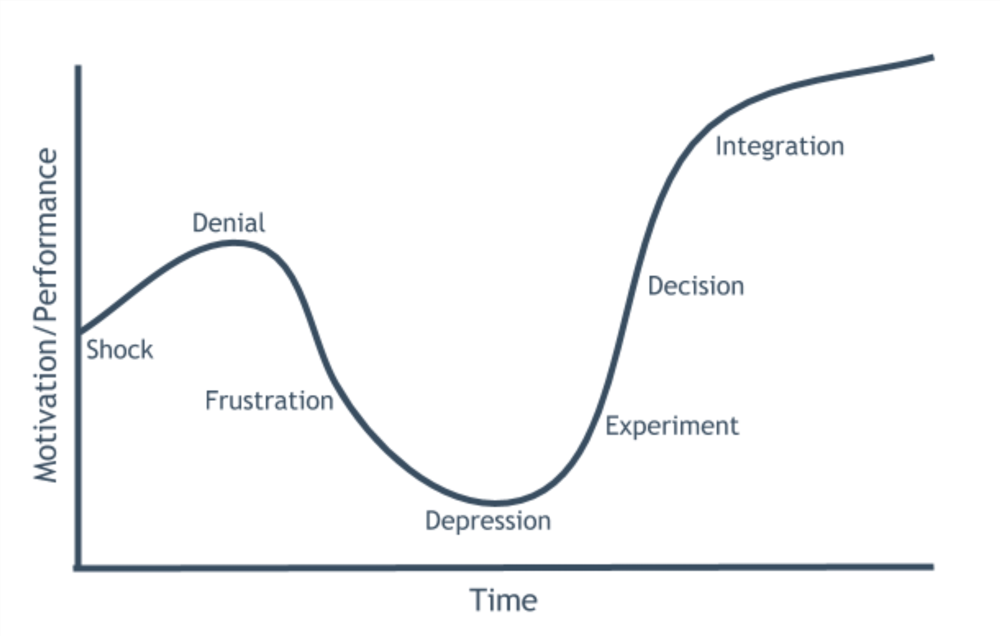
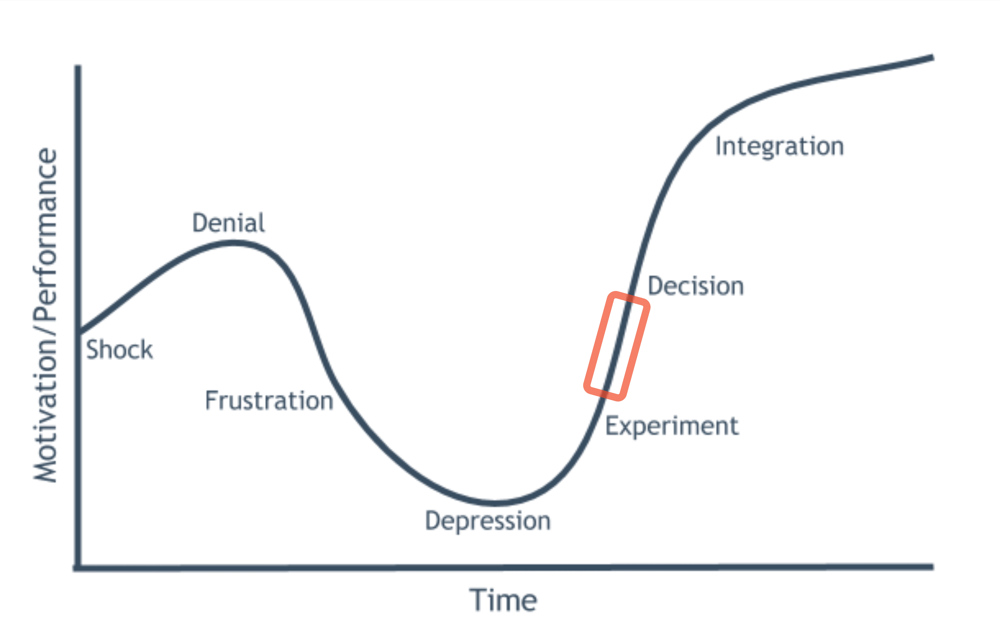
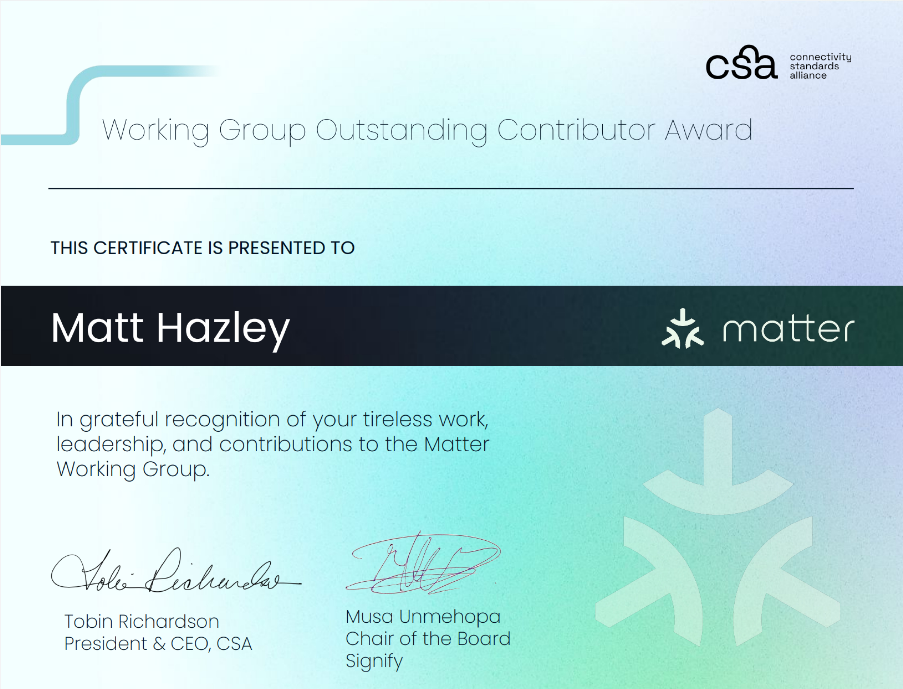
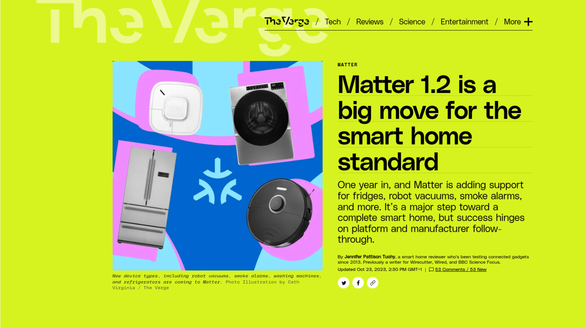

# **What's the Matter?**
***The Path to Smart Home Ubiquity***

**Matt Hazley**
Associate Principal Connectivity Engineer
*Dyson UK* / New Product Innovation Software Team

<!-- 
Hi everyone, my name is Matt Hazley, I am an Associate Principal Embedded Connectivity Engineer in Dyson's New Product
Innovation Software Team. I'd like to thank you all for coming to listen to my talk today, which is entitled
"Whats the Matter", The Path To Smart Home Ubiquity.

My aim today is to talk to you about the state of the Smart Home and to discuss the path towards ubiquity for both Product
Manufacturers and Smart Home Platforms alike, via the Matter Standard.

I'll also take some time to talk about what its been like to work on this standard and to try and deliver it into Dyson.
-->

---

## **Matt Hazley**

 

<!-- 
So, who am I and how have I ended up here today.

I started my career just over 14 years ago and for the first 7 years I worked on low level automotive sensor firmware, represented
here by the left-most pictures - we worked on low power tyre pressure sensing and we also looked at RF based tank level sensing for things
like fuel and adblue.

I did have a brief stint working on high throughput middlewares for stock exchange feed-handlers but if I am honest, I really missed
working on embedded products so I quickly escaped!

In 2016, I became the Firmware Lead at a startup called Brewbot, seen here bottom middle. We were developing an automated, home-brewing
machine and I think it was probably the most fun I have ever had but at the same time, also the most stress! 

This company ultimately ran out of money but it did awaken my love for all things IoT so following this, I moved to work in Dyson and
was an early employee into a new team there that was focusing on IoT prototyping and pushing connected innovation into the company's
roadmap.

It was here that I got involved with Smart Home technologies and this is the focus of my work today.
-->

---

# **Act 1:** The Path to Smart Home Ubiquity

# **Act 2:** How to Move Icebergs

<!--
So... I've broken this talk into two acts, one trechnical in nature, and the other a little more fun and philosophical, which we'll
get to later.
-->

---

# **Act 1:** *The Path to Smart Home Ubiquity*

# **Act 2:** How to Move Icebergs

<!--
Act One though, The Path to Smart Home Ubiquity....
-->

---

## **What is a Smart Home?**

 

<!--
What is a Smart Home? At Dyson, we believe a single connected product does not make a Smart Home.

A Smart Home is a combination of products working together to unlock value and features that are greater than the sum of its parts.

We believe the Smart Home Network increases in value as more devices are added and if different manufacturer products can work together.
-->

---

## **The State of the Smart Home ~2020**

 

<!-- 
So, around the turn of the decade we found ourselves in a situation like you see here.

Each existing Smart Home platform had its own protocols and configuration. It​ required comapnies to commit to technical development and
significant support to ‘on-board’ & support a new platform with their connected product.

In the diagram, consider that each arrow is a completely different integration and protocol. Also consider that some of the integrations
are cloud to cloud, whereas some are integrated with the device. 

This not only makes it difficult for device manufacturers but it also leads to a Poor User Experience and Lower Consumer Choice as the
user has to start seeking out what products work with their platform of choice.

This fragmented set of platforms was untenable and to a degree, this still exists today. It has to change.
-->

---

<!-- 
It has to change because Market Research shows that the Smart Home market is set to have almost doubled by the time we reach 2028.

Here, the Statista 2023 Market Research Report on Smart Home shows that Household penetration was around 14% in 2022 and is predicted to
be 33% by 2028 with a signifcant rise in Smart Appliances and Connectivity.

This means we need to start to think about a ubiquitous soluition to this problem.
-->

---

## **Enter Matter**

- Announced in early 2020 as **C**onnected **H**ome over **IP** (**CHIP**), renamed to **Matter** in 2021. ​

- Governed by **C**onnected **S**tandards **A**lliance, (**CSA**)

- Supported by Apple, Google, Samsung and Amazon

- v1.0 released in November 2022

<!-- 
Enter Matter!

Matter was announced in early 2020 and it claimed that it would create an open source codebase that would bring forward 
“a unifying standard for the smart home industry”​.

Apple, Amazon, Google & Samsung all formally announced their support at the inception of the project and this support has only grown
in the past few years, with around 50 companies showcasing Matter on their products at CES this past year. 

The project is goverened by the Connectivity Standards Alliance who were formerly the Zigbee Alliance and this is a consortium of 
almost 500 companies who came together over the last 20 years to develop Zigbee, and are now driving Matter.

v1.0 of Matter launched just over one year ago in Nov 2022 and it maintains a twice yearly release cycle with 1.2 having just dropped
a few weeks ago. 

The goal of Matter is to allow any device supporting Matter to interact with any Smart Home Ecosystem that understands Matter​.

So lets take a look at how it all works.
-->

---
## **Matter Technologies**

* A software stack (+ supporting code) that runs **on-device**​

* Utilises **IPv6 Networks** with the following core technologies
  * **Wi-Fi**
  * **Ethernet**​
  * **Thread**

* **Bluetooth Low Energy** is used for device on-boarding​

<!--
So, Matter is a software stack that runs on a Smart Home device, embedded within the Firmware.

Matter is also a software stack that runs on your phones and smart hubs in order to interact with these devices.

Matter uses IPv6 at its core and the technologies that enable its connectivity are Wi-Fi, Ethernet and Thread.

Bluetooth Low Energy is used for device on-boarding.

A little history here, this idea of mulitple, interconnected IPv6 link technologies was introduced by Nest Labs in 2014 under the name
Weave which then ended up at Google when they acquired Nest. Weave development has been superceded by Matter but its interconnected ethos
lives at the very core of Matter.

Now, I am going to make an educated guess that the majority of people here are familiar with Wi-Fi, Ethernet and Bluetooth. Typically
Thread is the one that less people have heard of so I thought I would take a moment to give you an overview of Thread.
-->

---

## **Thread**

 

<!--
Thread is a low power, meshing technology based on 802.15.4 which, if any of you have heard of Zigbee, this is basically the same physical radio layer as Zigbee So in a way, its effectively Zigbee, except that Thread uses IPv6 for communication, exactly like like a standard
Wi-Fi or Ethernet network that we are used to in our everyday lives.

Thread is then bridged back into a standard Wi-Fi or Ethernet network by a device called a Border Router, which is like a hub that runs
both Thread and Wi-Fi or Ethernet allowing it to understand and bridge both technologies.

Thread is exciting, because it allows low power devices to form a mesh network around the home and then communicate with devices on the
main network via this Border Router Hub. This leads to robust networks with very little downtime due to the mesh based connectivity. ​

So, now that we know waht Thread is, we can look at a typical Matter network
-->
---

## **Matter Network**

 

<!--
As we described before, here you see Wi-Fi and Thread devices, connected together on the same Local Area Network. 

Here we've introduced the Matter Controller. If we think of the devices as "servers", then the Matter Controller is the "client", allowing
users like you and me to interact with, and control, the devices on the network. 

We can also see the Thread Border Router Hub that we discussed before, bridging the thread devices into the network, allowing all devices
to communicate using Matter. 

So, I know what a lot of you are probably thinking, this hub just feels like another piece of hardware that users are going to have to
buy. 

Well, thats the beauty of it, most users already have one at home.
-->

---

## **Matter Network**

 

<!--
These border routers are simply built in to the various smart home hubs and speakers that a lot of users already have on their networks
today. 

For example, here we see a Google Nest Display and Smart Speaker inj the network alongside Googles Home app...
-->

---

## **Matter Network**

 

<!--
...and here we see the exact same network centered around an Apple Home Pod and the iOS Home App. 

These are real world examples and they already paint a picture of how Matter allows the consumer to have complete choice on which platform
they want to use, without requiring multiple integrations on the device side. 

I think you'll agree, this not only makes things simpler for the consumer, but also the device manufacturers!
-->

---

## **Matter Software Stack**

 

<!--
So, as discussed before, Matter is a software stack.

I wanted to try and take some time to show you how Matter leverages existing, battle tested technologies in order to integrate seamlessly.

Here you see a zoomed out Matter Software stack illustrating where Matter fits in. Above Matter, you have an application, and this is
typically the firmware running on a device or the application running on a mobile phone. Matter provides easy hooks for an application to
plug its business logic, into the protocol.

Then below Matter, we have technologies that form the core of all the networks we use today, TCP, UDP and IP are the backbone of nearly all
internet communications and these can all run seamlessly on the technologies that we describes before, Wi-Fi, Thread, etc

This begins to paint the picture of a ubiqitous protocol, built around common and standardised technologies.
-->

---

## **Matter Software Stack**

 

<!--
If we zoom in some more, we can begin to see the building blocks that make this protocol easy to interpret and communicate with.

Typically devices and clients are built on a platform, this may be a microcontroller, a linux computer like a raspberry pi or an android
or iOS phone.

Matter provides a standard Programming Interface, or API, for a platform and as such, platform vendors like chip suppliers and phone
operating system developers implement a version of this to run on their platform.

Making this a standard API means that all the layers above it can become standardised across the board. We can see this here, with Matter's Framing, Transport and Security layers all sitting on top of this common Platform API. 

Following this, a common protocol then needs what is known as its Application Layer, and in Matter, this is broken down into an
Interaction Model and a Data Model, which we'll now examine further. 
-->

---

## **Matter Data Model**

 

<!--
As we've stated. Matter's goal is to enable common communication with devices. For it to do this, it needs to have a robust and common way
to represent devices and this is known as the Data Model.

The clue is in the name really, it allows developers of the Matter standard to use a set of building blocks to model a device. 

These building blocks are known as clusters, which are distinct blocks of functionality grouped together as Attributes, Commands and
Events.

These clusters are unique and device types are built up as a collection of them. 

This is a little bit like Bluetooth Low Energy Services and Characteristics, if anyone is familiar with that.

So, what does this like in reality?
-->

---

## **Matter Data Model**

 

<!--
Here we see the representation of a very common Matter device, a Dimmable Bulb. 

So, if you wish to build a Dimmable Bulb that is Matter compatible, then you must expose the following three clusters. 

- On/Off, which as you could guess allows the bulb to be turned on and off
- Level, which given this is a "dimmable bulb", allows the level of the light output to be controlled
- Identify is also there, it is used to make a product identify itself, which is always useful if you have a lot of products on a network

These clusters alone have no relation to a dimmable bulb, but brought together under a Device Type ID, they represent a dimmable bulb
and this gives the Matter Controllers the best shot at representing them to you the user. 

These clusters could then also be used in the same way to represent a simple Fan for example.

Clusters should be though of as common, reusable building blocks. 
-->

---

## **Matter Interaction Model**

 

<!--
So, given theres a common way to represent devices, there should also be a common way for controllers to interact with them.

The Matter interaction model is very simple, it has Read, Write, Subscribe and Invoke. 

You can see how these link to the data model in the diagram. The controller can READ & SUBSCRIBE to Attrributes and Events, it can WRITE attributes and it can INVOKE commands. 

So, as you can see, the Data and Interaction Model combined give devices a common and ubiqitous way to be represented and interacted
with.
-->

---

## **Test, Certify, Attest, Commission**

 

<!--
As an aside, I don't want to cover it in great detail, but to close the loop, Matter also provides a common way to test devices, a common
way to certify devices and a common way to commission devices onto a Matter network. 

This means that devices can be certified as genuine and can be trusted by any platform that is onboarding them, thus meaning one less
thing for device manufacturers and platforms to worry about.

This is how everyone wins - follow the same path!
-->

---

## **Supported Devices**

 

<!--
When v1.0 of Matter was release just over a year ago, it supported a limited set of devices, namely the types that you see here:
Lights, Switches, Plugs, Thermostats, TV's, Window Blinds and Door Locks. 
-->

---

## **Supported Devices**

 

<!--
The v1.2 release that came just a few weeks ago brought support for:
Air Purifiers, Air Quality Sensors, Washing Machines, Refridgerators, Air Conditioning and Robotic Vacuum Cleaners.

Dyson was directly involved in the development of v1.2...
-->

---

## **Supported Devices**

 

<!--
...and for the past year of my life, my job has been to work on support for these devices, The Air Purifier, Air Quality Sensor and the Robotic Vacuum cleaner, which we will talk about briefly later on.
-->

---

# **Act 1:** The Path to Smart Home Ubiquity

# **Act 2:** *How to Move Icebergs*

<!--
So now that we have covered the what and the why of Matter, I'll move on to the second act, how to move icebergs.
-->

---

## **A Note on Icebergs**

 

<!--
So, first a note on Icebergs...
-->

---

## **A Note on ~~Icebergs~~ Companies**

 

<!--
Look, I'm sorry to all you climate enthusiasts out there, but I am infact just using the iceberg as a clunky metaphor to keep your attention and begin to talk to you about the difficulties of working on these open and collaborative standards and trying to bring them into real world products at large companies.

So, if you'll indulge me for just a second, big companies are sort of like icebergs...
-->

---

## **A Note on ~~Icebergs~~ Companies**

 

<!--
In many ways, big companies are majestic and offer a lot for you to see and experience. 

They have strong brands and influence the market with the great products they release. They are technology driven and its visbale in what they ship. They maybe
have a large market share and you may even have several of their products. 
-->

---

## **A Note on ~~Icebergs~~ Companies**

 

<!-- 
Show all the things you can see with big companies and then reveal all the things that you cannot see.

Point I am trying to drive home is that cloning Matter and understanding how it worked was only one small part of the endeavour we faced and bringing an entirely new technology and culture into a company and getting it onto a shippable product is not a simple task

Its important that we consider all of these things when trying to strive for change.
-->

---

## **Our Mission**

# 1. Get **Matter** ready for **Dyson**
# 2. Get **Dyson** ready for **Matter**

---

## **Matter Development Cycle**

 

---

## **Matter Development Cycle**

 

---

## **Matter Development Cycle**

 

---

## **Big Company Challenges**

* ### Contributing to Open Source Software
* ### Work alongside Competitor Companies
* ### Deviation from the known path
* ### Travel... a lot!

---

## **Open Source**

 

<!--
Th world is built on open source

Open source software stands as a cornerstone of collaborative innovation, fostering a global community where individuals come together to create, refine, and freely share solutions. This democratic approach to software development not only accelerates technological advancements but also empowers users with the freedom to understand, modify, and distribute software. The transparent nature of open source projects encourages diverse perspectives and collective problem-solving, leading to robust, secure, and high-quality software.

Open source software is at the foundations of a lot of proprietary code and as such, I think its important for companies to engage and contribute back.

This will lead to: Skill Enhancement, Professional Development, Community Engagement, Innovation and Problem Solving, Code Quality, Visibility and Recruitment.

Companies can also be quite savvy here as being at the forefront of these developments allows them to shape the narrative and that was definitely the case with Matter!

Important to be OPEN about open source - Set out guidelines around the Approvals Process, a Code of Conduct and consider IP at all points in the process.
-->

---

## **Collaboration with Competitors**

 

---

## **Deviation from the known path**

 

---

## **Deviation from the known path**

 

---

---

