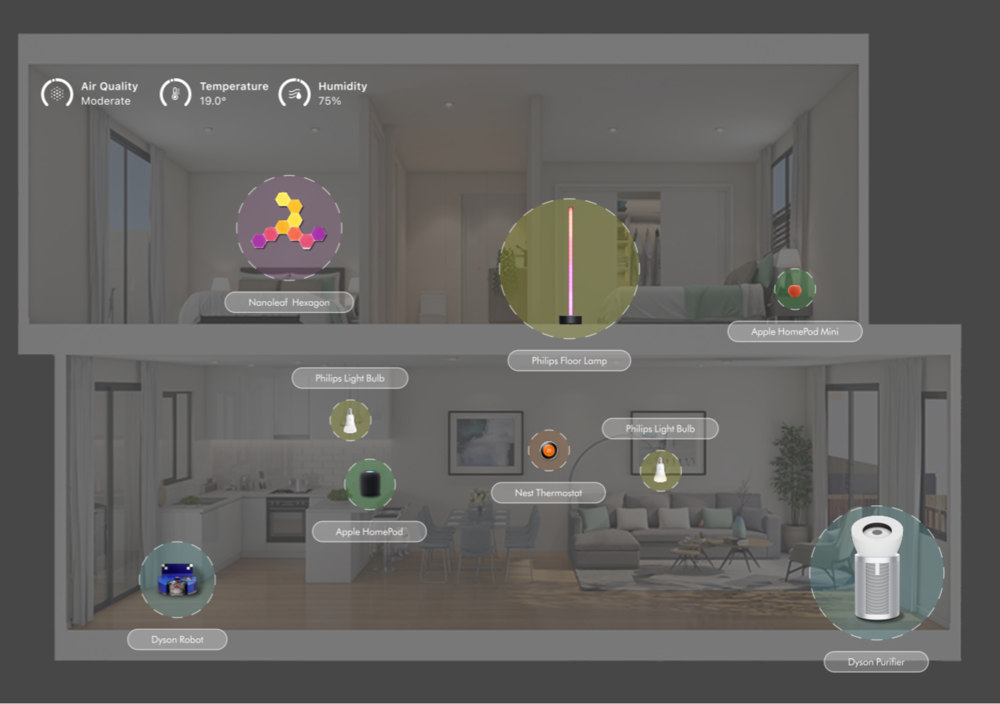
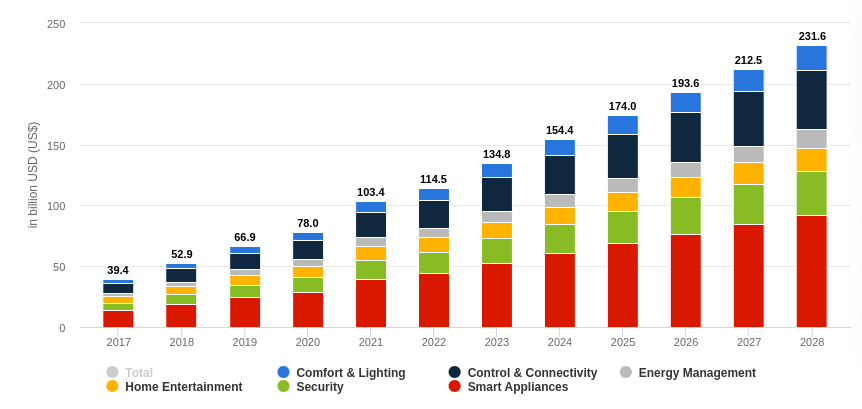
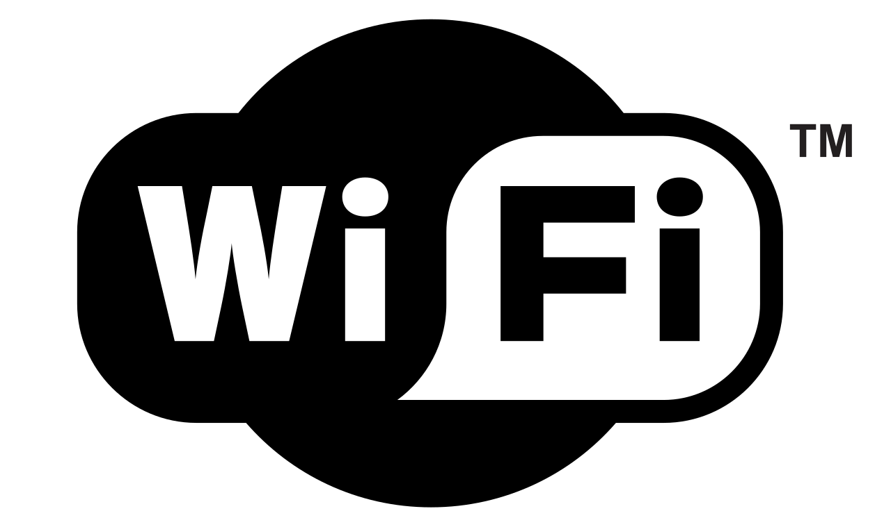
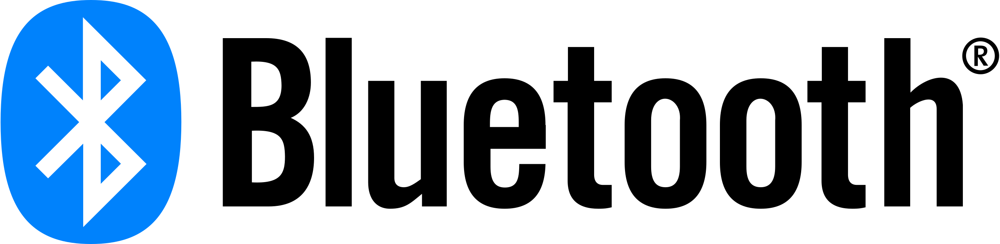
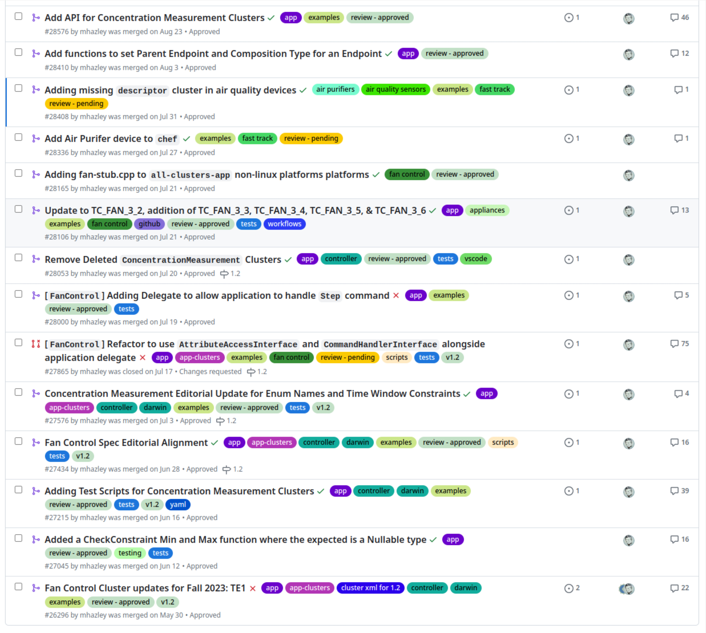
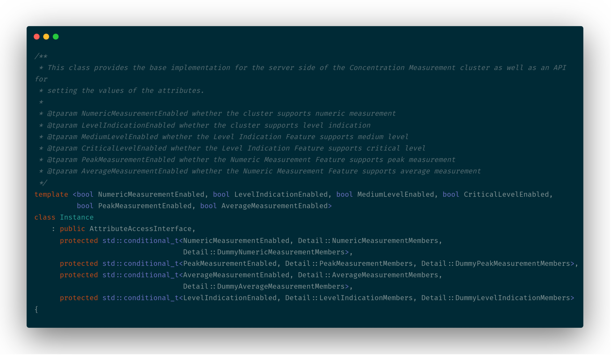

# **What's the Matter?**
***The Path to Smart Home Ubiquity***

**Matt Hazley**
Associate Principal Connectivity Engineer
*Dyson UK* / New Product Innovation Software Team

<!-- 
Hi everyone, my name is Matt Hazley, I am an Associate Principal Connectivity Engineer in Dyson's New Product Innovation Software Teams. My talk today for Codiax 2023 is titled "Whats the Matter" and my aim is to talk to you about the state of the Smart Home market today and to discuss to path towards ubiquity in this space for both Product Manufacturers and Smart Home Platforms.
-->

---

## **Matt Hazley**

 

---

# **Phase 1:** The Path to Smart Home Ubiquity

# **Phase 2:** How to Move Icebergs

<!--
Act One is commentary on why Matter came to be and a technical overview of the stack and protocol 
Act Two is a little more philosophical
-->

---

# **Phase 1:** *The Path to Smart Home Ubiquity*

# **Phase 2:** How to Move Icebergs

---

## **What is a Smart Home?**

 

<!--
A single connected product does not make a Smart Home.
A Smart Home is a combination of products working together to
unlock value and features that are greater than the sum of its parts.
The Smart Home Network increases in value as more devices are
added if different manufacturer products can work together.
-->

---

## **The State of the Smart Home ~2020**

 

<!-- 
Each existing Smart Home platform currently has its own protocols and configuration​
​Requires development to ‘on-board’ & support a new platform.​

Indicate how difficult it is for device manufacturers, an integration per platform, ranging from cloud 2 cloud and straight to device.

Poor User Experience
Lower Consumer choice
This fragmented set of platforms is untenable.
-->

---

<!-- 
Statista 2023 Market Research Report on Smart Home
Household penetration is around 14% in 2022, predicted to be 33% by 2028
-->

---

## **Enter Matter**

- Announced in early 2020 as **C**onnected **H**ome over **IP** (**CHIP**), renamed to **Matter** in 2021. ​

- Governed by **C**onnected **S**tandards **A**lliance, (**CSA**)

- Supported by Apple, Google, Samsung and Amazon

- v1.0 released in November 2022

<!-- Claims to “create a unifying standard for the smart home industry”​

Apple, Amazon, Google & Samsung formally announced their support at inception

At CES, around 30 companies showcased their involvement and / or pledged their support​

v1.0 launched in just over one year ago in Nov 2022.​ 

Allows a device to interact with any Smart Home Ecosystem that understands Matter​-->

---
## **Matter Technologies**

* A software stack (+ supporting code) that runs **on-device**​

* Utilises **IPv6 Networks** with the following core technologies
  * **Wi-Fi**
  * **Thread**
  * **Ethernet**​

* **Bluetooth Low Energy** is used for device on-boarding​

---

## **Thread**

 

<!-- Thread is a low power mesh technology based on 802.15.4 which is basically the same physical later as Zigbee, so its effectively zigbee, except that thread used IP to communicate, like a normal network that we are used to. ​

It is bridged back into a standard Wi-Fi network by a device called a Border Router. ​

A border router is basically a hub…. A smart speaker, another device, etc….​

Thread allows low power devices to form a mesh around the home and communicate with devices on the Wi-Fi network via this Border Router / hub. ​

So, now that we know this, then what does a Matter network look like... -->
---

## **Matter Network**

 

---

## **Matter Network**

 

---

## **Matter Network**

 

---

## **Matter Software Stack**

 

---

## **Matter Software Stack**

 

---

## **Matter Data Model**

 

---

## **Matter Data Model**

 

---

## **Matter Interaction Model**

 

---

## **Test, Certify, Attest, Commission**

 

---

## **Supported Devices**

 

---

## **Supported Devices**

 

---

## **Supported Devices**

 

---

# **Phase 1:** The Path to Smart Home Ubiquity

# **Phase 2:** *How to Move Icebergs*

---

## **A Note on Icebergs**

 

---

## **A Note on ~~Icebergs~~ Companies**

 

<!--
The iceberg here is really just a clunky metaphor to talk to you about the difficulties of working on such open and collaborative standards as the ones noted above.

Companies are like icebergs
-->

---

## **A Note on ~~Icebergs~~ Companies**

 

---

## **A Note on ~~Icebergs~~ Companies**

 

<!-- 
Show all the things you can see with big companies and then reveal all the things that you cannot see.

Point I am trying to drive home is that cloning Matter and understanding how it worked was only one small part of the endeavour we faced and bringing an entirely new technology and culture into a company and getting it onto a shippable product is not a simple task

Its important that we consider all of these things when trying to strive for change.
-->

---

## **Our Mission**

# 1. Get **Matter** ready for **Dyson**
# 2. Get **Dyson** ready for **Matter**

---

## **Matter Development Cycle**

 

---

## **Matter Development Cycle**

 

---

## **Matter Development Cycle**

 

---

## **Big Company Challenges**

* ### Contributing to Open Source Software
* ### Work alongside Competitor Companies
* ### Migrate from a well Established System
* ### Travel... a lot!

---

## **Open Source**

 

<!--
Th world is built on open source

Open source software stands as a cornerstone of collaborative innovation, fostering a global community where individuals come together to create, refine, and freely share solutions. This democratic approach to software development not only accelerates technological advancements but also empowers users with the freedom to understand, modify, and distribute software. The transparent nature of open source projects encourages diverse perspectives and collective problem-solving, leading to robust, secure, and high-quality software.

Open source software is at the foundations of a lot of proprietary code and as such, I think its important for companies to engage and contribute back.

This will lead to: Skill Enhancement, Professional Development, Community Engagement, Innovation and Problem Solving, Code Quality, Visibility and Recruitment.

Companies can also be quite savvy here as being at the forefront of these developments allows them to shape the narrative and that was definitely the case with Matter!

Important to be OPEN about open source - Set out guidelines around the Approvals Process, a Code of Conduct and consider IP at all points in the process.
-->

---

## **Collaboration with Competitors**

 

---
