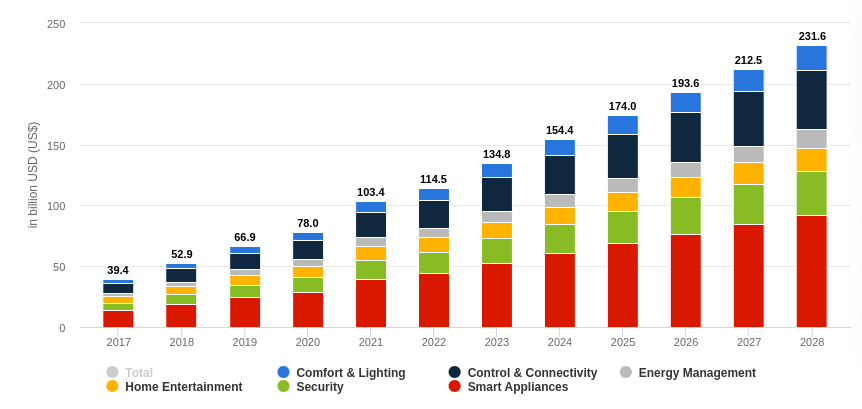

# **What's the Matter?**
***The Path to Smart Home Ubiquity***

**Matt Hazley**
Associate Principal Connectivity Engineer
*Dyson UK* / New Product Innovation Software Team

<!-- 
Hi everyone, my name is Matt Hazley, I am an Associate Principal Connectivity Engineer in Dyson's New Product Innovation Software Teams. My talk today for Codiax 2023 is titled "Whats the Matter" and my aim is to talk to you about the state of the Smart Home market today and to discuss to path towards ubiquity in this space for both Product Manufacturers and Smart Home Platforms.
-->

---

## **Phase 1:** The Path to Smart Home Ubiquity

## **Phase 2:** How to Move Glaciers (while not being an Imposter)

---

## **Phase 1:** *The Path to Smart Home Ubiquity*

## **Phase 2:** How to Move Glaciers (while not being an Imposter)

---

**The State of the Smart Home circa 2021-2023**
Fragmented
Indicate how difficult it is for device manufacturers, an integration per platform, ranging from cloud 2 cloud and straight to device.

Use a single diagram

<!-- 
Each existing Smart Home platform currently has its own protocols and configuration​
​Requires development to ‘on-board’ & support a new platform.​
S-->

---

**Why this is a problem**
Not only is this a poor user experience...
Smart Home Market is estimated to scale by x in the current decade
Prevalence of cheaper connected hardware and IoT know-how allowing companies to enter the market and offer connected features for their products.

This fragmented set of platforms is untenable.

Insert Market Research Diagrams

---

<!-- 
Statista 2023 Market Research Report on Smart Home
Household penetration is around 14% in 2022, predicted to be 33% by 2028
-->

---

**Enter Matter**
Announced in early 2020 as **C**onnected **H**ome over **IP** (**CHIP**), renamed to **Matter** in 2021. ​

Governed by **C**onnected **S**tandards **A**lliance, (**CSA**) ​

Claims to “create a unifying standard for the smart home industry”​

Apple, Amazon, Google & Samsung formally announced their support at inception

At CES, around 30 companies showcased their involvement and / or pledged their support​

v1.0 launched in just over one year ago in Nov 2022.​

---

**Technology**

A software stack (+ supporting code) that runs **on-device**​

Allows a device to interact with any Smart Home Ecosystem that understands Matter​

Utilises **IP Networks**, with **Wi-Fi/Ethernet** and  being the core network technologies​

**Bluetooth Low Energy** is used for device on-boarding​

Security focused!

---

**A Word on Thread**

**Diagram**

Thread is a low power mesh technology based on 802.15.4 which is basically the same physical later as Zigbee, so its effectively zigbee, except that thread used IP to communicate, like a normal network that we are used to. ​

It is bridged back into a standard Wi-Fi network by a device called a Border Router. ​

A border router is basically a hub…. A smart speaker, another device, etc….​

Thread allows low power devices to form a mesh around the home and communicate with devices on the Wi-Fi network via this Border Router / hub. ​

So, now that we know this, then what does a Matter network look like...

---

**Matter Network**
Diagram with generic border router​

---

**Matter Network**
Diagram with non-generic border router​ to show the compatibility

---

**Matter Software Stack**

Explode out a few diagrams:

Application
Matter
TCP | UDP
IPv6
Thread | WiFi | Ethernet | BLE

---

**Matter Software Stack**

Explode out a few diagrams:

Data Model | Interaction Model
ZCL
Security
Framing and Transport

---

**Matter Data Model**

---

**Matter Interaction Model**

---

**Supported Devices**

---

**Data Model of a Supported Device**

---

## **Phase 1:** The Path to Smart Home Ubiquity

## **Phase 2:** *How to Move Glaciers (while not being an Imposter)*

---

Get Matter onto Dyson Products

---

Add support for Dyson Products into Matter

* Join CSA
* Contribute to the Spec with other Companies
* Contribute to the open source spec with other Companies
* Take prototypes of our products to test events all around the world

---

Glacier Picture

---

We are asking to

* Contribute to open source
* Add more work for developers
* Require a hardware change to support the new code
* Travel about 5 times to attend global meetings
* Work with out competitors
* 

